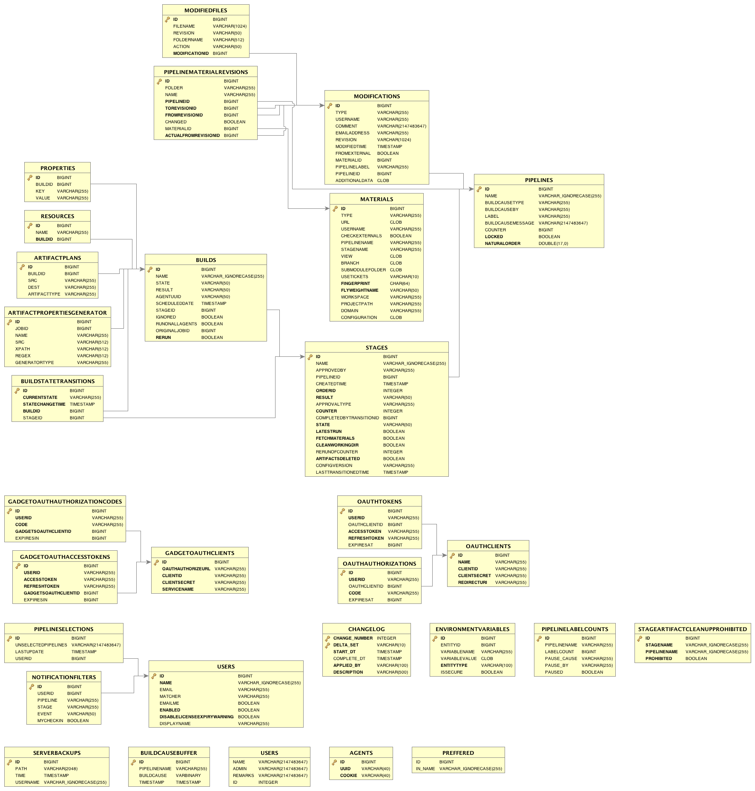

# 4.2.2 Database Management

GoCD uses [H2 Database](http://www.h2database.com/) as its choice of data store. In GoCD, H2 operates in an embedded mode, loaded into GoCD's JVM. As of the time this document was written, the H2 version in use was 1.3.168.

### 4.2.2.1 Schema

The database schema is primed as part of the database migration scripts that run during startup. An overview of the database schema is shown below:



### 4.2.2.2 Database migrations

GoCD uses [DB Deploy](https://code.google.com/p/dbdeploy/) to run DDLs/DMLs on the H2 database instance named **cruise.h2.db**. The deltas are added under

```
~/projects/go$ cd server/db/migrate/h2deltas
~/projects/go/server/db/migrate/h2deltas$ ls
10_add_stage_timestamp.sql
35_rename_usersettings_table.sql
...
```

The naming scheme that is followed is

```
<2 character major release number><2 character minor release number><3 character migration number>_<migration file name>.sql
```
For example, for major release 14, minor release 02 and migration number 005, the file name would be: **1402005_create_a_table_for_something.sql**

A guide on how to add a database migration can be found [here](../3/3.3.md).

### 4.2.2.3 Backup

At the filesystem level, backing up the database includes copying over the ```cruise.h2.db``` file. The *backup* feature in GoCD utilizes a [H2 feature](http://www.h2database.com/html/grammar.html?highlight=backup&search=backup#backup) which helps taking a hot backup of the database while it is in use. ```com.thoughtworks.go.server.service.BackupService```, along with other items, backups the H2 database as well. The ```void backupDb(File)``` method is the starting point of the execution flow which achieves this.

```
com.thoughtworks.go.server.service.BackupService

...
private void backupDb(File backupDir) throws SQLException {
        databaseStrategy.backup(backupDir);
}
...

```
