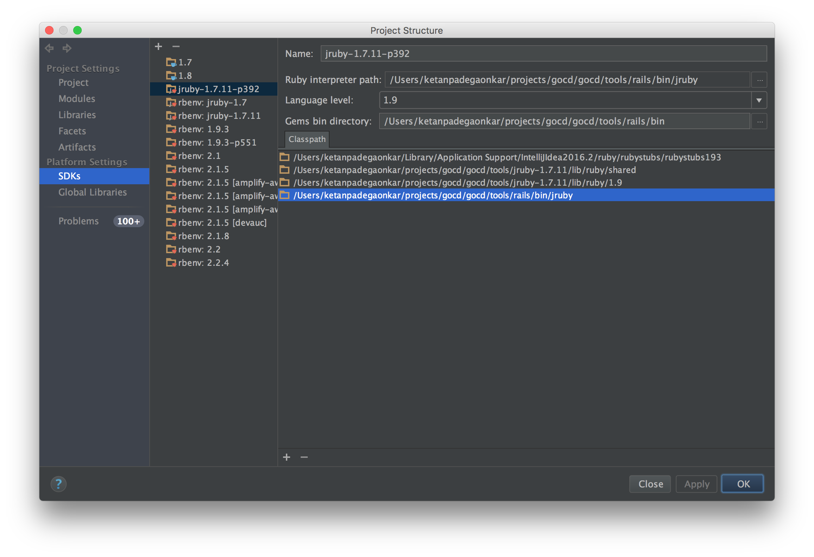
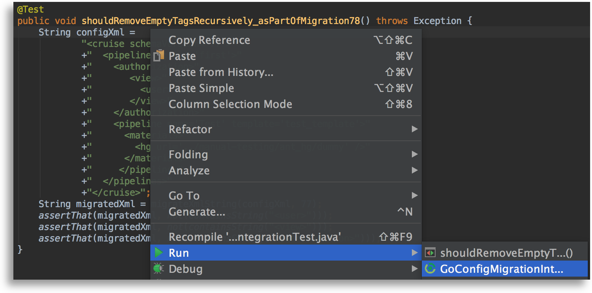

## 2.1 Setting up your development environment

### 2.1.1 Get the code and run a local build

GoCD requires the following software packages to build

- JDK 8 or above(OpenJDK or Oracle)
- Git (1.9+)
- NodeJS latest of 6.x (https://nodejs.org/en/download/) [Note: NodeJS 7 and 8 do NOT work]
- Python 2.x [Note: Python 3 does NOT work]
- yarn package manager (https://yarnpkg.com/en/docs/install)
- gcc/g++ 6.x (linux only). CentOS/RH users can find it [here](https://www.softwarecollections.org/en/scls/rhscl/devtoolset-6/). Ubuntu 12.04 and 14.04 users can find it [here](https://launchpad.net/~ubuntu-toolchain-r/+archive/ubuntu/test).
- Microsoft Visual C++ Build Tools 2015 (Windows only). Get it [here](https://chocolatey.org/packages/vcbuildtools)
- Microsoft Build Tools 2015 (Windows only). Get it [here](https://chocolatey.org/packages/microsoft-build-tools)

Assuming the codebase is cloned into `~/projects/go`, you need to execute the
following commands to build GoCD

```bash
~/projects/go$ unset GEM_HOME GEM_PATH # if you're using rvm
~/projects/go$ ./gradlew clean agentGenericZip serverGenericZip
```

After a successful build, the build artifacts are generated inside `target/` sub-directories within individual module directories and the ZIP installers for GoCD Server and GoCD Agent are generated inside `installers/target/distributions/zip/`.

```bash
~/projects/go$ find . -name target -type d
./addon-api/database/target
./agent/target
...
./tfs-impl/target
./util/target
~/projects/go$ ls installers/target/distributions/zip/
go-agent-16.7.0-3795.zip  go-server-16.7.0-3795.zip
```

#### For Windows Users
The easiest way to get started is by using [Chocolatey](https://chocolatey.org)

From an elevated command prompt run the following commands:
```
choco install nodejs --version 6.X.x
choco install python2
choco install yarn
choco install vcbuildtools
choco install microsoft-build-tools
```
You'll then want to set the Python environment variable:
`SETX PYTHON \path\to\python\python.exe` [Note: by default the path is c:\python27\python.exe]

Also ensure that your JAVA_HOME environment variable is pointing to the 64-bit version (i.e. it is in "Program Files" and not "Program Files (x86)")

### 2.1.2 Setup IntelliJ

If you have IntelliJ IDEA configured, you can, optionally, use it to build GoCD.

Prior to build via the IDE, we would have to prepare the working directory by copying the database deltas to the
configured location. You can achieve this by running the  following command in the working directory:

```bash
~/projects/go$ ./gradlew clean prepare
```

After the preparation phase has succeeded, open the project in IDEA

### 2.1.3 Running Development Server via IntelliJ IDEA

When developing using IntelliJ IDEA, it is always convenient to run the GoCD Server in *development mode*. Apart from the convenience, you also get

- Live debugging
- Faster feedback
- Hot-swapping changes while the JVM is up

The IDEA **Application** run-configuration can be setup using the values below:

```
Name: Development Server
Main Class: com.thoughtworks.go.server.DevelopmentServer
VM options: -Xms512m -Xmx1024m -XX:PermSize=400m
Working directory: <project-directory>/server
Environment variables: GEM_PATH=;GEM_HOME=;
Use classpath of module: gocd.development-utility.development-server.main
```

### 2.1.4 Running Development Agent via IntelliJ IDEA

The IDEA **Application** run-configuration can be setup using the values below:

```
Name: Development Agent
Main Class: com.thoughtworks.go.agent.DevelopmentAgent
Working directory: <project-directory>/agent
Use classpath of module: gocd.development-utility.development-agent.main
```

### 2.1.5 Running RSpec tests from the command line

Here are some rspec specific commands you may find useful —

```bash
$ ./gradlew rspec # run all specs, with default arguments
$ ./gradlew rspec -Popts='--pattern spec/**/api_v**/*_spec.rb' # to run api specs
$ ./gradlew rspec -Popts='--pattern spec/controllers' # to run controller specs
$ ./gradlew rspec -Popts='--pattern spec/foo/bar_spec.rb' # to run a single spec
```

It's probably quicker to run the RSpec tests from the command line instead of gradle:

```bash
cd server/webapp/WEB-INF/rails
../../../scripts/jruby -S rspec
../../../scripts/jruby -S rspec --pattern 'spec/**/api_v**/*_spec.rb' # to run api specs
../../../scripts/jruby -S rspec --pattern spec/controllers # to run controller specs
../../../scripts/jruby -S rspec --pattern spec/foo/bar_spec.rb # to run a single spec

```

### 2.1.6 Running RSpec tests from IntelliJ

1. Ensure that your JRuby SDK is setup properly

    ```
    Ruby interpreter path: <project-directory>/server/scripts/jruby
    ```

    

2. Ensure that your project module "server>server_test" is setup properly.

  1. Click "File menu > Project Structure"
  2. Select "Modules" in the "Project Structure" dialog
  3. Navigate to "server>server_test" and right-click to add "JRuby" (select the right jruby version). Then right click to add "JRuby on Rails"
    
    

    

3. Configure the default RSpec run configuration

  1. Open `Run -> Edit configurations...`
  2. Open the `Defaults` section and select `RSpec` in the listing
  3. Check the `Use custom RSpec runner script` checkbox
  4. Select `rspec` from `<project-directory>/server/scripts/jruby/rspec`
  5. Set the working directory to `<project-directory>/server/webapp/WEB-INF/rails`
  6. Set the `Ruby SDK` option to `Use other SDK and 'rspec' gem` with the dropdown set to the correct version of JRuby that you configured above `jruby-9.2.0.0`
     
  7. Click `Apply` to save
  8. Open a spec file and run it `Run -> Run 'somefile_spec.rb'`, or `Ctrl+Shift+F10`

### 2.1.7 Running integration tests from IntelliJ

While unit tests (those which don't use Spring autowiring) can be run directly from IntelliJ using the default JUnit runner, integration tests need to be run using IntelliJ's Gradle runner. The setup for this involves setting the Gradle runner up as shown below:


When running an integration test, you'll need to pick the Gradle runner instead of the JUnit runner, as shown below:



### 2.1.8 Working on single page apps

If you're working on some of the new pages in GoCD (pipeline config, agents, elastic profiles...). This will watch your filesystem for any JS changes you make and keep compiling the JS in the background. This usually takes a couple of seconds to compile, after you hit save.

```
~/projects/go$ cd server/webapp/WEB-INF/rails.new
~/projects/go/server/webapp/WEB-INF/rails.new$ yarn run webpack-watch
```

### 2.1.9 Running Javascript tests

To run javascript tests —

In CI environment (very slow for running tests after every change)

```
$ ./gradlew jasmine
```

In development environment (very quick)

Visit the following URLs:
* http://localhost:8153/go/assets/webpack/_specRunner.html (The agents, elastic profiles pages. Uses mithril 1.0). Ensure that you are running the [webpack watcher](#2-1-8-working-on-single-page-apps).


In order to run old javascript specs through browser, run following command to start server -

```gradle
./gradlew jasmineOldServer
```

Open a browser and navigate to `http://localhost:8888/`
