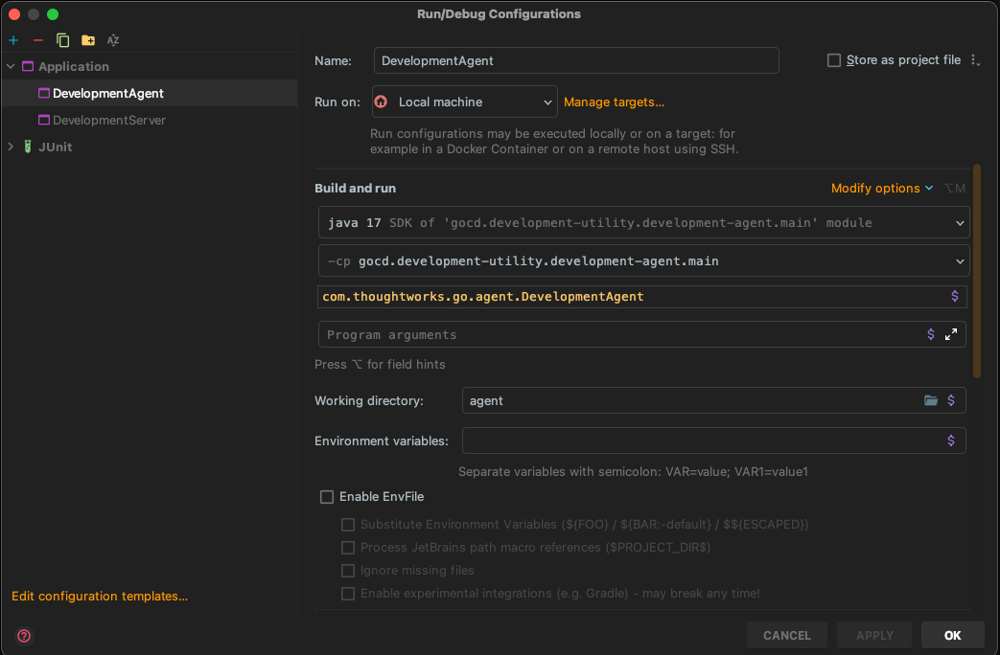

## GoCD Developer Documentation

This documentation should allow you to setup your developement environment to work on the [codebase](https://github.com/gocd/gocd) for [GoCD](https://www.gocd.org), a free and open-source Continuous Delivery server.

---

# Setting up your development environment

## Step 1: Get the code and run a local build

### Use docker image

[@tomzo](https://github.com/tomzo) maintains a [docker image](https://github.com/kudulab/docker-gocd-dojo) which can be used to build and test GoCD without installing all tools on the local host. If you have a local docker daemon, consider using the image.
The image uses the same tools which run on https://build.gocd.org GoCD agents, therefore it is consistent with the upstream requirement.

### Manual setup

GoCD requires the following software packages to build

- 64-bit JDK 11, 12, or 13 (We recommend downloading it from [OpenJDK](https://jdk.java.net/archive/), or [AdoptOpenJDK](adoptopenjdk.net))
- Git >= 2.20 (https://git-scm.com/downloads)
- NodeJS >= 14.3.0 (https://nodejs.org/en/download/)
- Yarn package manager
    - Generally, `npm install -g yarn` will suffice; otherwise, see https://yarnpkg.com/en/docs/install
- C/C++ build toolchain: certain `node` packages _might_ need to build native extensions
    - gcc/g++ 6.x (linux only). CentOS/RH users can find it [here](https://www.softwarecollections.org/en/scls/rhscl/devtoolset-6/). Ubuntu 12.04 and 14.04 users can find it [here](https://launchpad.net/~ubuntu-toolchain-r/+archive/ubuntu/test).
    - Microsoft Visual C++ Build Tools 2015 (Windows only). Get it [here](https://chocolatey.org/packages/vcbuildtools)
    - Microsoft Build Tools 2015 (Windows only). Get it [here](https://chocolatey.org/packages/microsoft-build-tools)

#### For Mac Users

[Homebrew](https://brew.sh) is the easiest way to install the prerequisite packages

```bash
brew install openjdk nodejs yarn git
```

#### For Windows Users

The easiest way to get the prerequisite packages is by using [Chocolatey](https://chocolatey.org)

From an elevated command prompt run the following commands:

```powershell
choco install git
choco install nodejs
choco install yarn # alternatively, npm install -g yarn
choco install vcbuildtools
choco install microsoft-build-tools
```

Also ensure that your `JAVA_HOME` environment variable is pointing to the 64-bit version (i.e. it is in "Program Files" and not "Program Files (x86)")

#### Clone the repository

The main repository is: https://github.com/gocd/gocd.

It is highly recommended to fork the main repository and clone your fork for development. You can then add the main repository as an upstream remote:

```bash
# Assuming your github username is `developer-extraordinaire`, clone your forked repo
git clone https://github.com/developer-extraordinaire/gocd
cd gocd
# Add the main repo as the remote `upstream`
git remote add upstream https://github.com/gocd/gocd
```

To pull changes from upstream into your local development branches:

```bash
git fetch upstream
git merge upstream/master # alternatively, you can rebase instead
```

#### Validate that you can build the zip installers

Execute the following commands to build GoCD server and agent installlers:

```bash
$ unset GEM_HOME GEM_PATH # if you're using rvm
$ ./gradlew clean agentGenericZip serverGenericZip
```

After a successful build, the ZIP installers for GoCD Server and GoCD Agent are outputted to `installers/target/distributions/zip/`

```bash
$ ls installers/target/distributions/zip/
go-agent-16.7.0-3795.zip  go-server-16.7.0-3795.zip
```

Compiled bytecode and other build artifacts can be found in each module's `target/` subdirectory:

```bash
$ find . -name target -type d
./addon-api/database/target
./agent/target
...
./tfs-impl/target
./util/target
```

If all went well, you should be in good shape to set up your IDE.

## Step 2: Setup IntelliJ

The core team use IntelliJ IDEA as the IDE for GoCD development (at least for Java code and related derivatives). If you use another IDE, it will be up to you to figure out a working configuration based off of these instructions. Either the the Community Edition or the paid Ultimate edition will work.

For TypeScript, JavaScript, Sass, Ruby, and other parts, some of us use other editors, such as Visual Studio Code, Sublime Text, Vim, Emacs, etc. That is completely optional.

1. Prior to importing a GoCD project in IntelliJ IDEA, one needs to build some prerequisite code to prepare one's working directory. This is done with the following command -- it may take a few minutes to run the first time, so maybe go grab a coffee :)

    ```bash
    $ ./gradlew clean prepare
    ```

2. After the preparation phase has succeeded, open the project in IDEA by opening the `build.gradle` file in the top level of the working directory and choosing to "Open as Project".

- At this point, IntelliJ IDEA is probably prompting you if you want to import the project using gradle. Click *Import Gradle Project*.

  

- Open project settings.

   - Select the latest JDK that is installed

   

   - **OPTIONAL for IDEA Ultimate Edition**: Setup a JRuby SDK (use `$GOCD_HOME/server/scripts/jruby`) as the JRuby binary (Ruby support is only available to Ultimate Edition users)

   

- Open Gradle Settings

  - Use the same JDK that you are using with the project.

  

- Install the Lombok IntelliJ plugin

  - Find `Lombok` in the plugin settings and install it

    

  - More info here https://projectlombok.org/setup/intellij
  - Restart IntelliJ IDEA after installing Lombok

- Configure annotation processing

  - The Lombok plugin will prompt you to setup an annotation processor
  - Enable annotation processing, setting IDEA to obtain processors from the project classpath (the default setting)

  

### 2.1: Running the Development Server via IntelliJ IDEA

- Open the class `DevelopmentServer`
- Right click and select *Create 'DevelopmentServer.main()'*

  

- Configure the DevelopmentServer JVM args (`-Xmx2g`) and working dir (`server`)

  

### 2.2: Running Development Agent via IntelliJ IDEA

- Open the class `DevelopmentAgent`
- Right click and select *Create 'DevelopmentAgent.main()'*

  

- Configure the DevelopmentAgent working dir `agent`

  

### 2.3: Running RSpec tests from the command line

Here are some RSpec specific commands you may find useful —

```bash
$ ./gradlew rspec # run all specs, with default arguments
$ ./gradlew rspec -Popts='--pattern spec/**/api_v**/*_spec.rb' # to run api specs
$ ./gradlew rspec -Popts='--pattern spec/controllers' # to run controller specs
$ ./gradlew rspec -Popts='--pattern spec/foo/bar_spec.rb' # to run a single spec
```

It's probably quicker to run the RSpec tests from the command line instead of gradle:

```bash
cd server/webapp/WEB-INF/rails
../../../scripts/jruby -S rspec
../../../scripts/jruby -S rspec --pattern 'spec/**/api_v**/*_spec.rb' # to run api specs
../../../scripts/jruby -S rspec --pattern spec/controllers # to run controller specs
../../../scripts/jruby -S rspec --pattern spec/foo/bar_spec.rb # to run a single spec

```

### 2.3b: [OPTIONAL for Ultimate Edition] Running RSpec tests from IntelliJ IDEA Ultimate Edition

1. Ensure that your project module "server>server_test" is setup properly.

    1. Click "File menu > Project Structure"
    2. Select "Modules" in the "Project Structure" dialog
    3. Navigate to "server>server_test" and right-click to add "JRuby" (select the right jruby version). Then right click to add "JRuby on Rails"

    

    

2. Configure the default RSpec run configuration

  1. Open `Run -> Edit configurations...`
  2. Open the `Defaults` section and select `RSpec` in the listing
  3. Check the `Use custom RSpec runner script` checkbox
  4. Select `rspec` from `<project-directory>/server/scripts/jruby/rspec`
  5. Set the working directory to `<project-directory>/server/webapp/WEB-INF/rails`
  6. Set the `Ruby SDK` option to `Use other SDK and 'rspec' gem` with the dropdown set to the correct version of JRuby that you configured above `jruby-9.2.0.0`
     
  7. Click `Apply` to save
  8. Open a spec file and run it `Run -> Run 'somefile_spec.rb'`, or `Ctrl+Shift+F10`

### 2.4: Working on single page apps

If you're working on some of the new pages in GoCD (pipeline config, agents, elastic profiles...), this will watch your filesystem for any JS changes you make and keep compiling the JS in the background. This usually takes a couple of seconds to compile, after you hit save.

```bash
# forking in a subshell won't change the directory after interrupting/exiting
$ (cd server/src/main/webapp/WEB-INF/rails && yarn run webpack-watch)
```

### 2.5: Running Javascript tests

To run javascript tests —

#### In development environment (very quick)

Visit the following URLs:
* http://localhost:8153/go/assets/webpack/_specRunner.html (The agents, elastic profiles pages. Uses mithril 1.0). Ensure that you are running the [webpack watcher](#24-working-on-single-page-apps).

In order to run old javascript specs through browser, run following command to start server -

```bash
$ ./gradlew jasmineOldServer
```

Open a browser and navigate to `http://localhost:8888/`

#### In CI environment (very slow for running tests after every change)

```bash
$ ./gradlew jasmine
```
